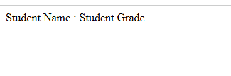
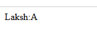
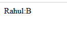
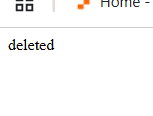
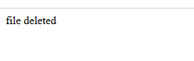
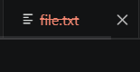
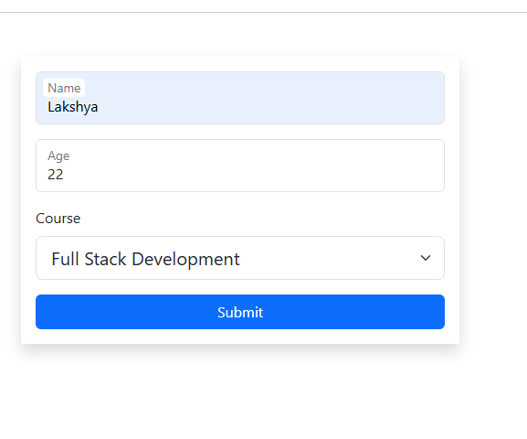
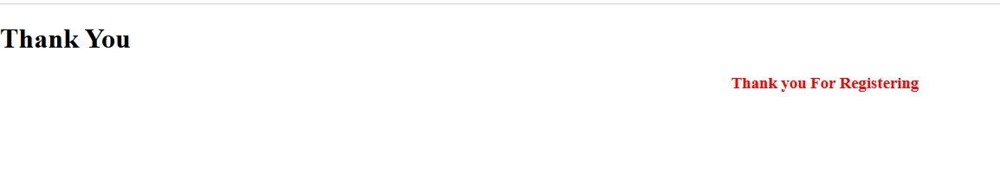
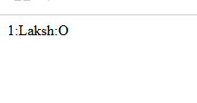

# Php_Hw_Practicals 4
 ## 
 Php_prac4 

## FileHandling
# Read

-----------------------------------------------------
# Write

--------------------------------------------------
# Append

------------------------------------------------
## Delete

---------------------------------------------------------
## Student Form Redirecting
# student form

# redirect page

-----------------------------------------------------------
## 
 Oops 

# constructor

# Abstract Method

# Interface method

